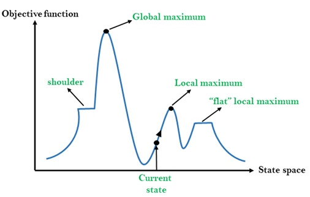
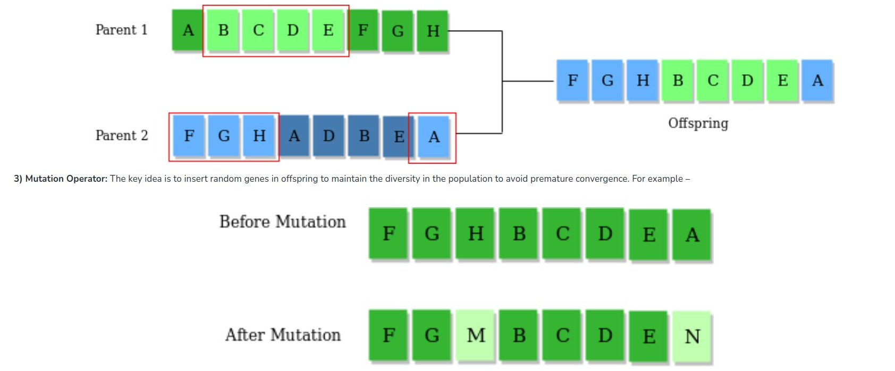

# Module 02

### Search Algorithms
Search algorithms in AI are algorithms that aid in the resolution of search issues. A search issue comprises the search space, start, and goal state. By evaluating scenarios and alternatives, search algorithms in artificial intelligence assist AI agents in achieving the objective state.


The algorithms provide search solutions by transforming the initial state to the desired state. Therefore, AI machines and applications can only perform search functions and discover viable solutions with these algorithms.

##### Terminologies
Search
: Searching solves a search issue in a given space step by step. Three major factors can influence a search issue.

Search Space
: A search space is a collection of potential solutions a system may have.

Start State
: The jurisdiction where the agent starts the search.

Goal test
: A function that examines the current state and returns whether or not the goal state has been attained.


#### Types of Search Algorithms
##### Uninformed Search
Uninformed search is a method of searching a search tree without knowledge of the search space, such as initial state operators and tests for the objective, and is also known as blind search. It goes through each tree node until it reaches the target node. These algorithms are limited to producing successors and distinguishing between goal and non-goal states.

Example: Breadth-first-search (BFS), Depth-first-Search (DFS) etc.

##### Informed Search/Heuristic Search
The informed search algorithm is more useful for large search space. Informed search algorithm uses the idea of heuristic, so it is also called Heuristic search.

Heuristics function: Heuristic is a function which is used in Informed Search, and it finds the most promising path. It takes the current state of the agent as its input and produces the estimation of how close agent is from the goal. The heuristic method, however, might not always give the best solution, but it guaranteed to find a good solution in reasonable time. Heuristic function estimates how close a state is to the goal. It is represented by `h(n)`, an it calculates the cost of an optimal path between the pair of states. The value of the heuristic function is always positive.

Example: Best-first-search, A* Search etc, Beam Search etc.


#### Best First Search
Best-First Search (BFS) is an informed graph traversal algorithm that explores a graph by selecting the most promising node based on a heuristic function. It combines the advantages of both breadth-first search (BFS) and depth-first search (DFS) algorithms. BFS uses a priority queue to prioritize nodes according to their heuristic values.

The heuristic function provides an estimate of the cost from the current node to the goal node. The algorithm maintains a priority queue of nodes and, at each step, selects the node with the lowest heuristic value as the next node to explore. This makes Best-First Search more efficient in terms of reaching the goal quickly by prioritizing nodes that are likely closer to the goal.

##### Algorithm
```
Best-First-Search(Graph g, Node start)
    1) Create an empty PriorityQueue
       PriorityQueue pq;
    2) Insert "start" in pq.
       pq.insert(start)
    3) Until PriorityQueue is empty
          u = PriorityQueue.DeleteMin
          If u is the goal
             Exit
          Else
             Foreach neighbor v of u
                If v "Unvisited"
                    Mark v "Visited"                    
                    pq.insert(v)
             Mark u "Examined"                    
End procedure
```
#### Beam Search Algorithm

- Beam search is a heuristic search algorithm that explores a graph by expanding the most optimistic node in a limited set. Beam search is an optimization of best-first search that reduces its memory requirements.

- Best-first search is a graph search that orders all partial solutions according to some heuristic. But in beam search, only a predetermined number of best partial solutions are kept as candidates. Therefore, it is a greedy algorithm.

- Beam search uses breadth-first search to build its search tree. At each level of the tree, it generates all successors of the states at the current level, sorting them in increasing order of heuristic cost. However, it only stores a predetermined number (β), of best states at each level called the beamwidth. Only those states are expanded next.

##### Algorithm
```
Start 
Take the inputs 
NODE = Root_Node & Found = False
If : Node is the Goal Node,
     Then Found = True, 
Else : 
     Find SUCCs of NODE if any, with its estimated cost&
     store it in OPEN List 
While (Found == false & not able to proceed further), do
{
     Sort OPEN List
     Select top W elements from OPEN list and put it in
     W_OPEN list and empty the OPEN list.
     for each NODE from W_OPEN list
     {
         if NODE = Goal,
             then FOUND = true 
         else
             Find SUCCs of NODE. If any with its estimated
             cost & Store it in OPEN list
     }
}
If FOUND = True,
    then return Yes
else
    return No
Stop
```
#### Hill-Climbing Search

- Hill climbing algorithm is a local search algorithm which continuously moves in the direction of increasing elevation/value to find the peak of the mountain or best solution to the problem. It terminates when it reaches a peak value where no neighbor has a higher value.
- Hill climbing algorithm is a technique which is used for optimizing the mathematical problems. One of the widely discussed examples of Hill climbing algorithm is Traveling-salesman Problem in which we need to minimize the distance traveled by the salesman.
- It is also called greedy local search as it only looks to its good immediate neighbor state and not beyond that.
- A node of hill climbing algorithm has two components which are state and value.
- Hill Climbing is mostly used when a good heuristic is available.
- In this algorithm, we don't need to maintain and handle the search tree or graph as it only keeps a single current state.

##### Different regions in the state space landscape


*Local Maximum:* Local maximum is a state which is better than its neighbor states, but there is also another state which is higher than it.

*Global Maximum:* Global maximum is the best possible state of state space landscape. It has the highest value of objective function.

*Current state:* It is a state in a landscape diagram where an agent is currently present.

*Flat local maximum:* It is a flat space in the landscape where all the neighbor states of current states have the same value.

*Shoulder:* It is a plateau region which has an uphill edge.



##### Algorithm
~~~
Step 1: Evaluate the initial state, if it is goal state then return success and Stop.
Step 2: Loop Until a solution is found or there is no new operator left to apply.
Step 3: Select and apply an operator to the current state.
Step 4: Check new state:
    Step 4.1 If it is goal state, then return success and quit.
    Step 4.2 Else if it is better than the current state then assign new state as a current state.
    Step 4.3 Else if not better than the current state, then return to step2.
Step 5: Exit.
~~~

#### Simulated Annealing
The SA algorithm is based on the annealing process used in metallurgy, where a metal is heated to a high temperature quickly and then gradually cooled. At high temperatures, the atoms move fast, and when the temperature is reduced, their kinetic energy decreases as well. At the end of the annealing process, the atoms fall into a more ordered state, and the material is more ductile and easier to work with.

Similarly, in SA, a search process starts with a high-energy state (an initial solution) and gradually lowers the temperature (a control parameter) until it reaches a state of minimum energy (the optimal solution).

SA has been successfully applied to a wide range of optimization problems, such as TSP, protein folding, graph partitioning, and job-shop scheduling. The main advantage of SA is its ability to escape from local minima and converge to a global minimum.

The simulated annealing process starts with an initial solution and then iteratively improves the current solution by randomly perturbing it and accepting the perturbation with a certain probability. The probability of accepting a worse solution is initially high and gradually decreases as the number of iterations increases.

The SA algorithm is quite simple, and it can be straightforwardly implemented as described below.


##### Algorithm

~~~
T := T_max
x := generate the initial candidate solution
E := E(x) compute the energy of the initial solution

while T > T_min and E > E_th do
    x_new := generate new candidate solution
    E_new := compute the energy of the new candidate x_new
    delta_E := E_new - E
    if delta_E > 0 then
        x := x_new
        E := E_new
    end
    else if exp(delta_E/T) > rand(0,1) then
        x := x_new
        E := E_new
    end
    
    T := T/alpha // cool the temparature
end

return x
~~~

#### Genetic Algorithm
Genetic Algorithms(GAs) are adaptive heuristic search algorithms that belong to the larger part of evolutionary algorithms. Genetic algorithms are based on the ideas of natural selection and genetics. These are intelligent exploitation of random searches provided with historical data to direct the search into the region of better performance in solution space. They are commonly used to generate high-quality solutions for optimization problems and search problems.

Genetic algorithms simulate the process of natural selection which means those species that can adapt to changes in their environment can survive and reproduce and go to the next generation. In simple words, they simulate “survival of the fittest” among individuals of consecutive generations to solve a problem. Each generation consists of a population of individuals and each individual represents a point in search space and possible solution.

##### Search space
The population of individuals are maintained within search space. Each individual represents a solution in search space for given problem. Each individual is coded as a finite length vector (analogous to chromosome) of components. These variable components are analogous to Genes. Thus a chromosome (individual) is composed of several genes (variable components). 

##### Fitness Score
A Fitness Score is given to each individual which shows the ability of an individual to “compete”. The individual having optimal fitness score (or near optimal) are sought. 

The GAs maintains the population of n individuals (chromosome/solutions) along with their fitness scores.The individuals having better fitness scores are given more chance to reproduce than others. The individuals with better fitness scores are selected who mate and produce better offspring by combining chromosomes of parents.

##### Selection 
The idea is to give preference to the individuals with good fitness scores and allow them to pass their genes to successive generations.

##### Crossover
This represents mating between individuals. Two individuals are selected using selection operator and crossover sites are chosen randomly. Then the genes at these crossover sites are exchanged thus creating a completely new individual (offspring). For example

##### Mutation
The key idea is to insert random genes in offspring to maintain the diversity in the population to avoid premature convergence.



##### Algorithm

~~~
1) Randomly initialize populations p
2) Determine fitness of population
3) Until convergence repeat:
      a) Select parents from population
      b) Crossover and generate new population
      c) Perform mutation on new population
      d) Calculate fitness for new population
~~~


